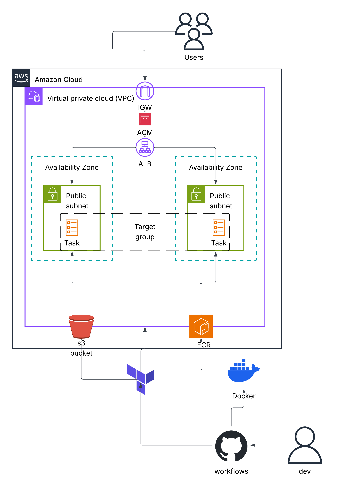
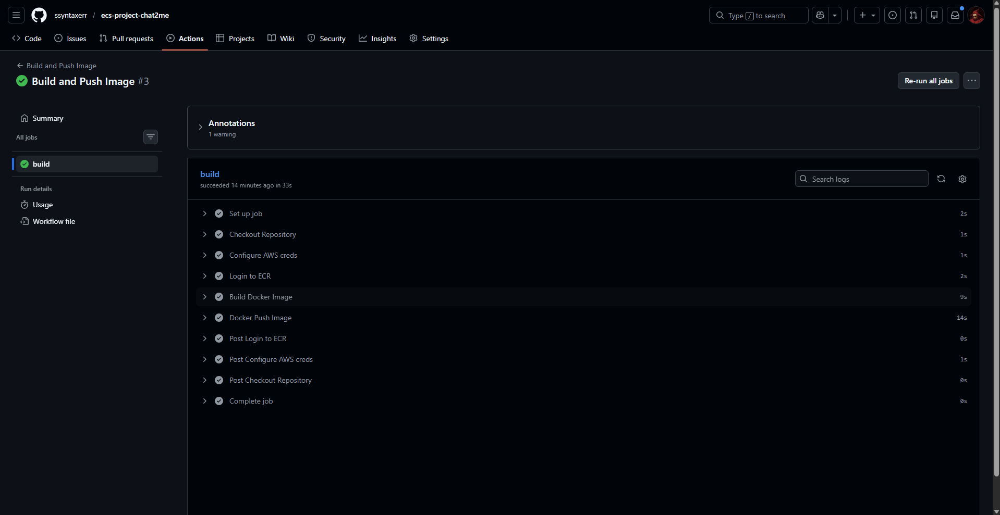
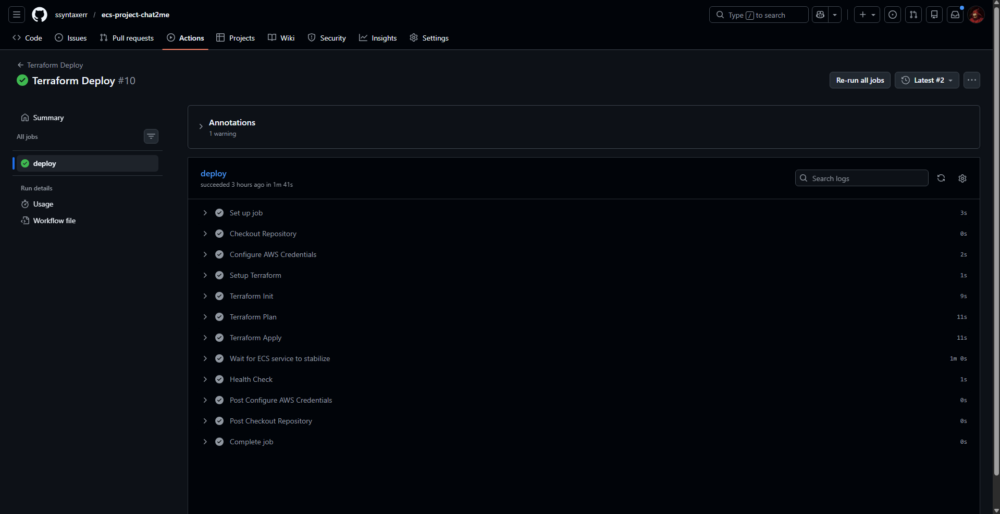
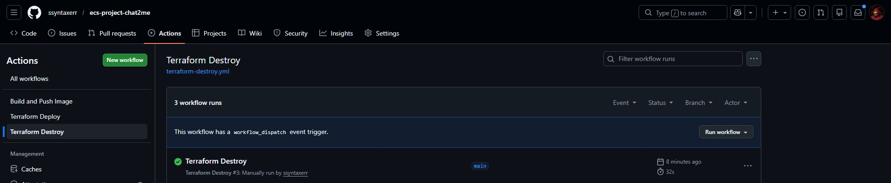
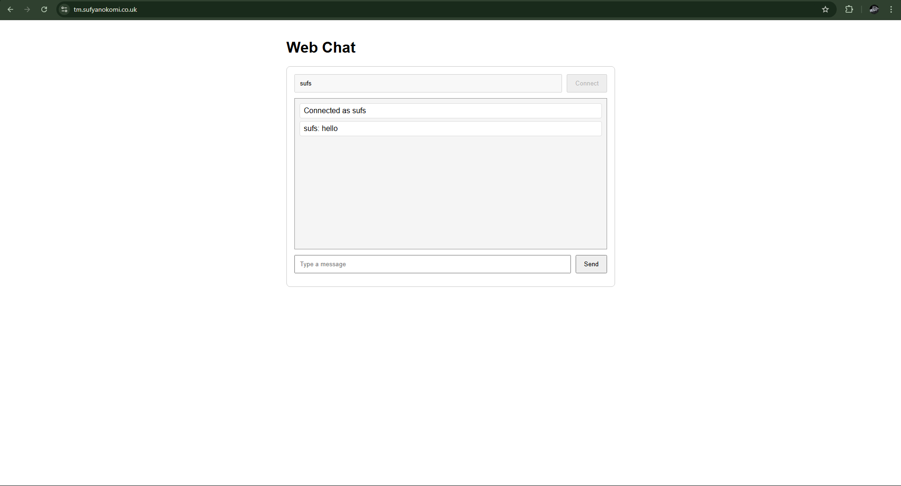

# ECS project (Chat2Me)
 **Overview:** Build, containerise and deploy an application using Docker, Terraform, and ECS, with HTTPS and a custom domain.


## Application 🖥️
Chat2me is a lightweight real-time web chat application using FastAPI and WebSockets, to understand how modern web services implement live communication between multiple clients.

The project converts a previous desktop socket-based chat client into a browser-accessible web service, allowing multiple users to connect through a web page and exchange messages in real time.

Made by: https://github.com/KareemOkomi

## Infrastructure 🏢
### Architecture 📐


Main Components:
 - VPC & public subnets in seperate availability zones and an Internet Gateway for internet access
 - ALB, redirected to from domain
 - ECS cluster running fargate service
 - ECR to push and pull image from
 - S3 bucket for remote statefile 

### Project Structure 🪜
```
├── Chat2Me/                      
│   ├── app/
│   ├── ...
│
├── infra/
|   |── provider.tf                 
│   ├── backend.tf
│   ├── main.tf
|   |── terraform.tfvars
│   ├── variables.tf
│   ├── outputs.tf
│   └── modules/
│       ├── vpc/
│       ├── acm/
│       ├── alb/
│       ├── ecs/
│       └── ecr/
├── .github/
│   └── workflows/
│       ├── build-and-push.yml
|       |── terraform-destroy.tf         
│       └── deploy.yml
|── Dockerfile         
├── .gitignore
|── images/
└── README.md
```
## Local setup ⚙️

```
git clone git@github.com:KareemOkomi/Chat2Me.git
python -m venv .venv
source .venv/bin/activate  .venv\Scripts\activate
pip install -r requirements.txt
uvicorn app.main:app --host 0.0.0.0 --port $PORT
```
## Dockerize 📦
1. Multi-stage Dockerfile
2. Build image
```
docker build -t <image> .
```
3. Run container
```
docker run -p 8000:8000 <image>:version
```
4. Health check
```
curl http://localhost:8000/health
```
## Clickops 🖱
Created manually using AWS console for understanding of infrastructure and services.
### ECR
1. Create repo in ECR
2. Configure AWS credentials
```
aws configure
```
3. Verify
```
aws sts get-caller-identity
```
4. Authenticate Docker to ECR
```
aws ecr get-login-password --region <region> | docker login --username AWS --password-stdin <aws_account_id>.dkr.ecr.<region>.amazonaws.com
```
5. Tag and push image
```
docker tag image-name:latest <aws_account_id>.dkr.ecr.<region>://
docker push <aws_account_id>.dkr.ecr.<region>:image-name
```
### VPC
Created
 - VPC & public subnets
 - Route tables, routes and IGW
 - ALB, listeners, target group
 - Security groups

## ECS
Created 
 - ECS Cluster
 - ECS service
 - Task definition

## ACM
Created
 - ACM certificate for HTTPS

### Process
User accesses the domain, DNS resolves it to the Application Load Balancer, which routes the request to a healthy ECS task running the containerized application. The container processes the request and the response is returned to the user through the load balancer.

## Infrastructure as Code (Terraform) 🌍
Completely tore down infra made through console to rebuild fully using Terraform.

Added S3 bucket to infra to store statefile (with s3 native state locking). 

Terraform init to initialize terraform in infra/
```
terraform init
```
Terraform plan & apply to deploy infra
```
terraform plan
terraform apply
```

## CI/CD ♾
Created build & push pipeline for the Docker image. Deploy pipeline for Terraform infrastructure. Destroy pipeline to tear it down.

Screenshots:





## Hardest Challenges & Key Takeaways 🤬 🔑
- "Chicken & egg" problem. Couldn't deploy infra before pushing image to ecr. Solved by running ecr and other necessary infra before the rest.
- Took me a while to understand the purpose of variables and outputs in Terraform and how they interact when it comes to different modules.
- Learnt the importance of planning the architechture and infrastructure before going into VS code and writing Terraform files. 


 
